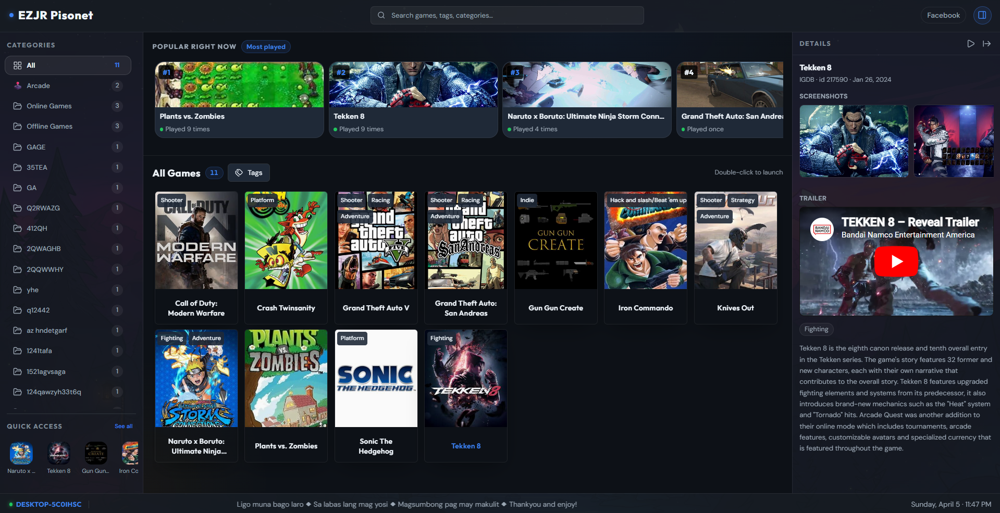
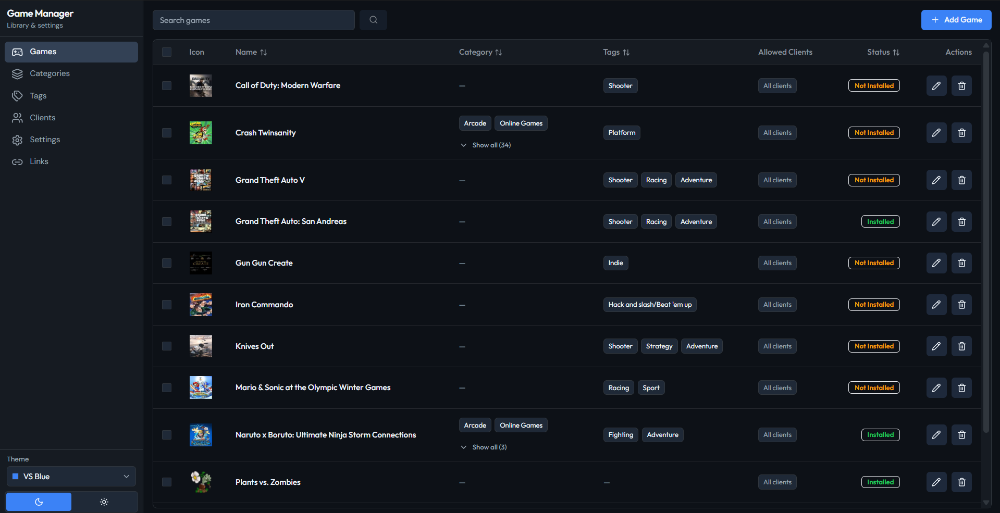
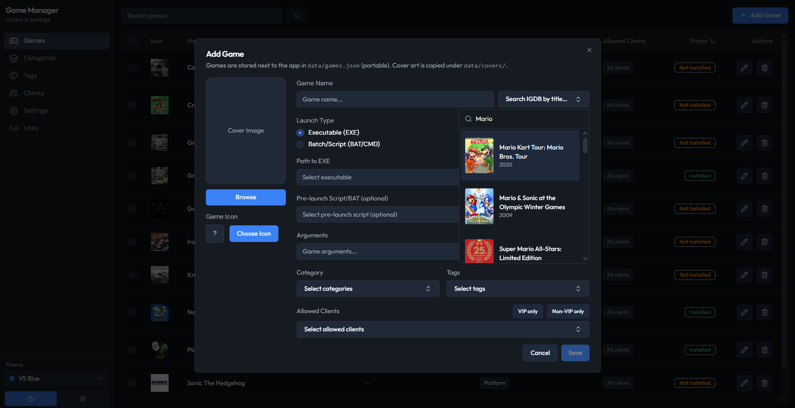
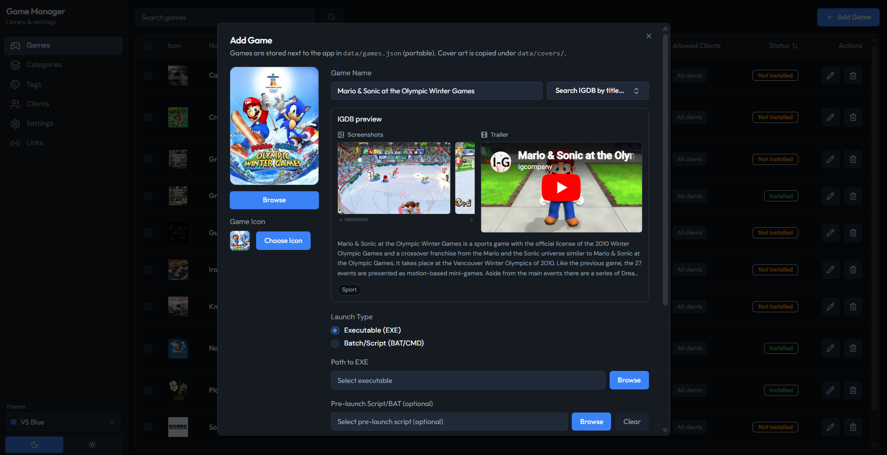

# Game Launcher v1.0.0

A small **Wails** monorepo with two desktop apps that share on-disk JSON (and images) as the source of truth for a PC game library.

## Game Client



## Game Manager





| App | Directory | Role |
| --- | --- | --- |
| **Game Client** | [`game-client/`](game-client/) | Launcher players use: browse, filter, launch games, quick access, links, optional IGDB-style details. |
| **Game Manager** | [`game-manager/`](game-manager/) | Admin tool: edit games, categories, tags, clients, links, quick access, and settings the client honors. |

Both frontends use **Next.js** exported to static files; Wails embeds `frontend/out` and calls **Go** for file I/O, process launch, and OS integration.

## How data is shared

- Game Manager writes files such as `games.json`, `categories.json`, `tags.json`, `clients.json`, `links.json`, `quick-access.json`, and `settings.json` into a **`data`** folder.
- Game Client resolves that folder by preferring **`<Game Client executable directory>/data`**. In development it also falls back to `game-client/build/bin/data` or `game-manager/build/bin/data` when those exist, so you can point both apps at the same dataset during testing.
- Images (covers, icons, etc.) live under the same data tree; the client serves safe relative paths from that directory.

For client-specific build layout and feature summary, see [`game-client/build/README.md`](game-client/build/README.md). For manager features and build steps, see [`game-manager/README.md`](game-manager/README.md).

## Prerequisites

- Go and [Wails CLI](https://wails.io/docs/next/gettingstarted/installation/)
- Node.js and npm (per-app under each `frontend/`)

## Build (quick reference)

**Game Manager** (edit data):

```bash
cd game-manager/frontend && npm install && npm run build && cd .. && wails build
```

**Game Client** (launcher):

```bash
cd game-client/frontend && npm install && npm run build && cd .. && wails build
```

Use `wails dev` in either `game-manager` or `game-client` for live development.

## License

See [`game-client/LICENSE`](game-client/LICENSE) and [`game-manager/LICENSE`](game-manager/LICENSE).
